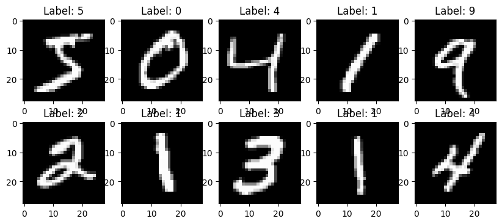
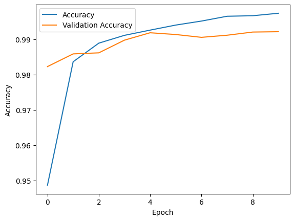
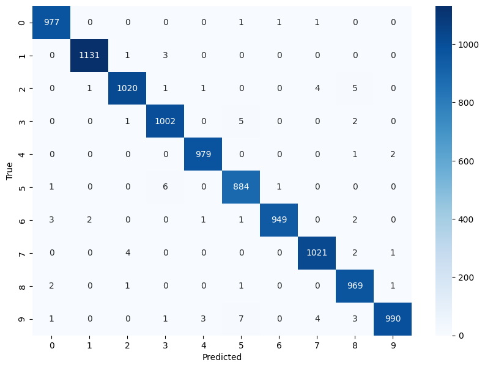
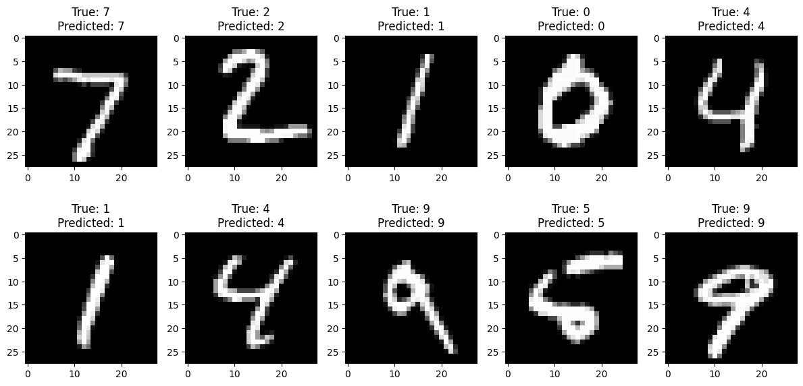
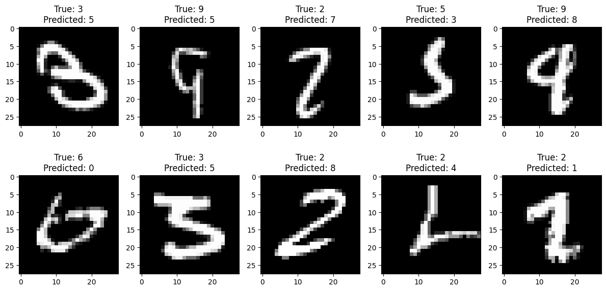

# Handwritten Digit Recognition Project

## Description

This project implements a Handwritten Digit Recognition System using the MNIST dataset and a neural network. The system is capable of accurately identifying handwritten digits and displaying the predictions. It serves as an introductory example to neural network-based image classification.

## Table of Contents

- [Description](#description)
- [Table of Contents](#table-of-contents)
- [Technologies Used](#technologies-used)
- [Installation](#installation)
- [Usage](#usage)
- [Results](#results)
- [Acknowledgements](#acknowledgements)
- [Author](#author)

## Technologies Used

- Python
- TensorFlow
- Matplotlib

## Installation

1. Clone this repository:
2. The script will display training progress and evaluation metrics.
3. The trained model will be saved for later use.

## Results

### Sample Images

### Training History

### Confusion Matrix

### Visualizing Predictions

### Misclassification Prediction

## Acknowledgements

- The MNIST dataset is used for this project.
- Inspiration and guidance from various online tutorials and resources.

## Author

- Your Name
- GitHub: [@kuhuData](https://github.com/kuhuData)

